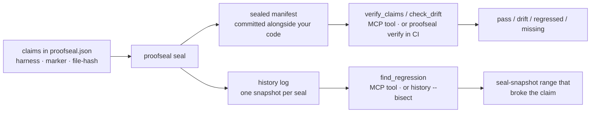

# ProofSeal

**Regression memory for coding agents.** (There's a CLI and CI mode too — but the agent loop is the point.)

An agent edits your repo. Every unit test passes. It commits. But it quietly changed a numeric output, deleted the one line that fixed a bug last year, or broke a behavior no test covers — and you find out weeks later from an angry issue. The agent had no memory that those things were ever *supposed* to hold.

ProofSeal is that memory. You seal a handful of claims about how the repo behaves; then, **before it commits**, an agent asks ProofSeal over MCP: *did my edit regress anything that was sealed?* It gets back `pass / drift / regressed / missing` per claim — and when something broke, the seal-snapshot range where it happened.

```
Agent edits parser.ts → unit tests green → about to commit.
  check_drift  →  fix-null-check: REGRESSED (marker gone)
                  finance-totals: DRIFT (within tolerance, fine)
Agent reverts the bad change before the commit ever lands.
```

## How it works



1. **You declare claims once** — most usefully: *"this seeded command still prints these numbers"* (a harness). Also: *"this fix's marker is still in the code"*, or *"this file hashes to X."*
2. **`seal` records them** into a manifest committed alongside your code, and appends a history snapshot.
3. **An agent checks before committing** — via the MCP `check_drift` / `verify_claims` tools — or your CI runs `proofseal verify` on every push. Harmless change is `drift` (exit 0); broken promise is `regressed` (exit 1).
4. **`find_regression` remembers** — every seal is a snapshot, so when a claim regresses you get the seal-snapshot range where it happened.

## The agent loop (start here)

ProofSeal ships an MCP stdio server. This is the part worth your attention.

```bash
claude mcp add proofseal -- npx proofseal mcp start
```

Seven tools, every one fail-open (a broken repo returns `{ok:false, warn:true, error, hint}` instead of killing the session):

| Tool | What the agent gets | Why Bash can't do it |
|------|---------------------|----------------------|
| `check_drift` | per-claim pass/drift/regressed/missing, **without** resealing | `grep`/`sha256sum` can't tell a benign edit from a broken promise |
| `verify_claims` | full verification + seal status | a file tool can't detect a tampered manifest |
| `run_harness` | runs one seeded command, compares numeric output under tolerance | raw float output hashes diverge across CPUs; this quantizes first |
| `find_regression` | the seal-snapshot range that introduced a regression | `git bisect` needs a runnable predicate per commit; this answers from recorded snapshots instantly |
| `claim_history` | status timeline for one claim across every seal | `git log` shows commits, not whether a claim held |
| `seal_manifest` | reseal + append a snapshot — **gated** | hand-editing the manifest always breaks it; resealing is the only legal mutation |
| `list_claims` | the configured claims, schema-validated | reading the JSON by hand skips validation + defaults |

`seal_manifest` is the one tool that overwrites the very claims an agent verifies against — so over MCP it is **refused by default** (`{ok:false, gated:true}`). Resealing belongs to a human: set `PROOFSEAL_ALLOW_RESEAL=1` in the server env to authorize it, or just run `proofseal seal` in your own shell. This keeps an in-session agent from resealing away a regression it just introduced.

The pattern: **the agent calls `check_drift` (or `verify_claims`) in its pre-commit step.** If anything it touched is `regressed`, it fixes or reverts before the commit lands — the regression never reaches your history.

This isn't aspirational — here's a [captured trajectory](docs/demo/agent-catch-trajectory.md) of an agent (Claude, over MCP) catching a silent 7% error in a financial calculation that no test covered, and reverting it before the commit. Reproducible end-to-end.

## Claim types

Ordered by how much they earn their keep.

| Type | What it asserts | Why it's here |
|------|-----------------|---------------|
| `harness` | A seeded command's numeric output stays deterministic — round-half-even quantization, then an rtol/atol tolerance fallback against a committed reference vector | **The reason this tool exists.** Behavior is what unit tests, `git`, and `grep` all miss. Exact-hash match → `pass`; within tolerance → `drift`; outside → `regressed` |
| `marker` | A distinctive substring is still present in a file (whitespace-normalized) | Cheap "did the fix survive a refactor?" check. Honest caveat: it verifies *text*, not behavior, and markers in minified/generated code are fragile. File edited but marker intact → `drift`; gone → `regressed`; file gone → `missing` |
| `file-hash` | The file's sha256 matches the sealed hash | **`git` already does this.** Use it only for a file outside version control, or a release artifact you ship separately. Any content change → `regressed` (no drift state) |

`drift` exists only for `marker` and `harness`. Exit-code contract: `0` for pass/drift, `1` for regressed/missing/seal mismatch, `2` for preconditions (each named in the output).

## 60-second quickstart (CLI / CI)

```bash
npm install --save-dev proofseal
npx proofseal init                 # scaffolds proofseal.json + proofs/ + a sample claim

# The claim that matters most — a deterministic numeric harness:
npx proofseal claim add --id finance-totals --type harness \
  --cmd "node scripts/report-totals.mjs" --desc "Quarterly totals stay deterministic"

# Or let it propose claims from your working diff (then commit the ones worth keeping):
npx proofseal suggest                 # prints suggested marker/file-hash claims for changed files
npx proofseal suggest --staged --write  # append the suggestions straight into proofseal.json

npx proofseal seal                 # run + record, seal manifest, append history snapshot
                                   # → prints "Now commit these files: …" — commit them all
npx proofseal verify               # exit 0 = pass/drift, 1 = regressed/missing, 2 = precondition
```

When something regresses later:

```bash
npx proofseal history --bisect
# finance-totals: last pass 428088b4e1d2 → regressed at a91c03ffe002
#   range spans 14 commits — seal more often (e.g. in CI on main) for tighter localization
```

Bisect localizes between **seal snapshots**, not commits. For commit-level localization you don't even need this tool — `git bisect run npx proofseal verify` does it for free, at the cost of re-running the suite per probed commit. ProofSeal's `history --bisect` is the instant version: it reads already-recorded snapshots, so it answers without re-running anything, and that same answer is available to agents over MCP as `find_regression`. Seal in CI on main (single writer, linear history) for the tightest ranges; if branches seal concurrently, add `proofs/history.jsonl merge=union` to `.gitattributes` (entries are ordered by `issuedAt`, so union-merge interleaving is safe).

## Run it in CI

Copy this into `.github/workflows/proofseal.yml`:

```yaml
name: Verify proofseal manifest

on:
  push:
    branches: [main]
  pull_request:
    branches: [main]

jobs:
  verify:
    runs-on: ubuntu-latest
    steps:
      # fetch-depth: 1 is sufficient — verify re-derives the key from the
      # manifest's embedded gitCommit and never shells out to git.
      - uses: actions/checkout@v4
        with:
          fetch-depth: 1

      - uses: actions/setup-node@v4
        with:
          node-version: 22

      # Note: manifest.gitCommit intentionally lags HEAD — it records the
      # commit that was checked out at seal time, not the verifying commit.
      - name: Verify sealed manifest
        run: npx proofseal verify
```

Two things first-time CI users hit:

- **Commit the seal outputs.** `seal` writes the manifest, the rewritten `proofseal.json`, and any harness reference vectors — and prints the exact list. If CI says `reference-vector-not-found`, you sealed locally and didn't commit the outputs.
- **`manifest.gitCommit` ≠ HEAD is normal.** It records the commit at seal time. Verification works against it directly.

## The seal — two modes, and which one you actually get

ProofSeal signs the manifest with Ed25519 in one of two modes. `verify` tells you which one you're looking at (`signerMode`) and prints an honest one-line `guarantee` so the tool can never overclaim.

**Derived mode (default — commit-bound, not authentication).** With no key configured, the signing key is derived from `sha256(gitCommit:salt:'proofseal/v1')`, and both `gitCommit` and `salt` live *in the manifest itself*. Anyone holding the manifest can re-derive the key and re-sign in one line. So the default signature adds no tamper-evidence over the sha256 hash it signs — and that hash adds nothing over `git`, because the manifest is a committed file. **Your real anchor is the git commit.** The one thing it buys: the manifest stays **self-describing outside a git context** — a tarball, a release artifact, a `fetch-depth: 1` clone — while pinned to the exact commit it sealed. Treat derived mode as a commit-bound checksum with a fancy name.

**Key mode (real authentication — when you bring a key).** Set `PROOFSEAL_SIGNING_KEY` (a 32-byte Ed25519 seed, 64-hex) or `PROOFSEAL_SIGNING_KEY_FILE` (a PEM/DER private key) at **seal** time. The key is never written to the repo; `signerMode` is recorded as `key`. Now the signature is genuine authentication — *if* the verifier pins the expected public key:

```bash
PROOFSEAL_SIGNING_KEY=$YOUR_SEED npx proofseal seal     # sign with a real key
npx proofseal verify --pubkey <hex>                     # pin it: TOFU authentication
npx proofseal verify --require-signed                   # refuse the derived downgrade
```

`--pubkey <hex>` is the strong check: it fails unless the manifest was signed by *that* key, so it closes both the derived downgrade and a key-substitution. `--require-signed` only rules out the naive derived seal (an attacker with their own real key still passes it — use `--pubkey` when that matters). The signed message binds `signerMode` + `publicKey`, so a signature can't be replayed across modes or have its pubkey field swapped. If a manifest claims `key` mode but its pubkey is still re-derivable from the commit, verify warns that it is **not** externally authenticated. For agents, the verdict is a structured boolean — `signature.authenticated` is `true` **only** for key mode + a matching `--pubkey` pin; branch on it rather than on `signature.valid` (which is also `true` for the derived and no-pin cases).

The TOFU caveat is real: a pin is exactly as trustworthy as the channel that delivered the pubkey. If you need full keyless identity / transparency-log provenance, run [cosign](https://github.com/sigstore/cosign) on top — the two compose.

Zero runtime crypto dependencies — Node's built-in crypto, plus commander, zod, and the MCP SDK.

## Library API

```ts
import { seal, verify } from 'proofseal';

const sealed = await seal({ root: '.' });
// sealed.filesWritten → the files to commit

const result = await verify({ root: '.' });
// result.summary → { totalClaims, pass, drift, regressed, missing }
// result.exitCode → 0 | 1 | 2
```

## Benchmarks

ProofSeal, cosign, and in-toto solve different problems and **they stack**: ProofSeal for claim semantics and history (and the agent-facing MCP loop), cosign for artifact identity, in-toto for supply-chain steps. The comparison below is about *adoption cost* and *which capabilities exist* — all tools installed and measured on the same machine (three bench fixtures in `bench/fixtures/`, 100 claims each; Apple M4 Pro, Node v22.19.0). Full report with provenance, seeds, and per-mutation breakdown: [`bench/results/report.md`](bench/results/report.md).

| Metric | ProofSeal | checksum script | cosign (keyless) | cosign (keypair) | in-toto |
|---|---|---|---|---|---|
| Setup steps (count) | 4 | 3 | 3 | 3 | 4 |
| Setup time (median, s) | 12.14 | 0.03 | N/A — requires interactive OIDC | 3.07 | 1.47 |
| Config LOC | 7 | 109 | 53 | 53 | 64 |
| Secrets to manage (count) | 0 | 0 | 0 | 1 | 1 |
| Verify latency p50 / p95 (ms) | 117.9 / 270 | 677.3 / 729.4 | N/A — requires interactive OIDC | 714.4 / 1252.7 | 264.5 / 272.2 |
| Tamper signaled (% of 45) | 100% (45/45) | 100% (45/45) | N/A — requires interactive OIDC | 100% (45/45) | 100% (45/45) |
| Four-state classification (ProofSeal taxonomy) | 45/45 (100%) | N/A — taxonomy absent | N/A — taxonomy absent | N/A — taxonomy absent | N/A — taxonomy absent |
| Drift vs regression distinction | yes | N/A — capability absent | N/A — capability absent | N/A — capability absent | N/A — capability absent |
| Temporal history + bisection | yes | N/A — capability absent | N/A — capability absent | N/A — capability absent | N/A — capability absent |

Reading the table: every real tool signals 100% of the 45 seeded mutations, each judged under its own semantics — a cosign hard FAIL on a benign append is correct for cosign's security model, and a practitioner-grade `SHA256SUMS` over all git-tracked files catches every byte-level change. ProofSeal's difference is **not** a detection score the others failed, and it is **not** the seal. It's two things the other tools don't have: the four-state classification (pass/drift/regressed/missing) that lets an agent tell a benign edit from a broken promise, and the seal history with bisection that answers "when did this break?" — both exposed over MCP so an agent can use them inside its own commit loop. The four-state row is ProofSeal's own taxonomy, so competitors are marked N/A rather than scored against it. The cosign-keyless cells marked N/A require an interactive OIDC browser flow that can't run headless; its setup steps, config LOC, and secrets were measured statically.

## FAQ

**Why does `seal` exit 1 but still write history when a claim fails?**

A failing snapshot is what lets `find_regression` / `history --bisect` localize the regression later. Skipping the snapshot would destroy the evidence.

**Can I use `verify --json` in CI?**

Yes — the JSON schema is pinned (v1) and the exit-code contract (0/1/2) is stable. Drift does not fail the build; regressions and missing claims do.

**What happens when a teammate (or agent) clones and verifies?**

It works — verify needs only the committed manifest, `proofseal.json`, and reference vectors. That's why `seal` prints the commit checklist: it lists every file verify needs that isn't committed yet, so the outputs travel together.

**Isn't `git bisect run proofseal verify` enough?**

For a human at a terminal, often yes — and it's commit-exact. ProofSeal earns its place when (a) you want the answer *without* re-running the suite per commit (it reads recorded snapshots), and (b) you want an *agent* to get that answer mid-session over MCP. If neither applies, `git bisect run` is a fine, dependency-free choice.

## Support

ProofSeal is maintained by one person. Realistic expectations:

- **Bugs:** open an issue with the [bug template](https://github.com/rudycelekli/proofseal/issues/new?template=bug.yml) — OS, node version, exact command, and the `verify --json` output. That JSON is usually enough to fix it without back-and-forth.
- **Response time:** issues are triaged daily; expect a first response within ~48h.
- **Windows:** best-effort in v0.x (see Limitations) — reports are still very welcome and get fixed.

## ⚠️ Limitations

Read this before adopting. ProofSeal is built and maintained by a solo maintainer; the surface is small on purpose.

- **The default seal is not authentication.** In derived mode (the default) the seal is a commit-bound checksum, re-derivable by anyone with the manifest — don't rely on it to prove identity. For real authentication, seal in key mode (`PROOFSEAL_SIGNING_KEY`) and verify with `--pubkey <hex>`; see "The seal — two modes" above. Even then it's trust-on-first-use, only as strong as how you delivered the pubkey.
- **Content-hashed build outputs break file-hash claims every build.** A Vite output like `index.Dk3mP9qR.js` gets a new name and hash on every rebuild. Don't put file-hash claims on hashed bundles; claim the source, or use a marker on a stable file.
- **Non-deterministic test suites can't be harness claims.** Harness claims require seeded, deterministic numeric output. Parallel test runners, wall-clock timings, and unordered output will produce permanent drift or regression noise.
- **Cross-platform hash divergence on built artifacts.** `seal` records the platform, and `verify` warns when the sealed platform differs from the verifying one — but binary artifacts may legitimately differ across platforms. Seal and verify built artifacts on the same platform, or claim only platform-independent files.
- **git autocrlf can flip text hashes.** Pin line endings with `.gitattributes` (`* text=auto eol=lf`) before sealing file-hash claims on text files. When a regression is caused purely by line endings, verify says so in the claim detail.
- **Windows is best-effort and untested in v0.x.** The suite is tested on ubuntu and macos; the Windows CI lane runs non-blocking (`continue-on-error`) until it has been observed green. Claim paths are normalized to forward slashes on all platforms, but known residuals exist: harness commands are spawned through the platform shell, so POSIX-isms (`python3`, `&&`) may fail under cmd.exe, and cmd.exe reports command-not-found as exit 9009 rather than 127.
- **Bisect granularity is seal frequency, and rewritten history orphans recorded SHAs.** `history --bisect` localizes between seal snapshots, not commits. Squash-merge, rebase, or force-push can leave history pointing at SHAs git no longer knows; bisect tags those `(unreachable — rewritten history?)`.
- **Markers in minified or generated code are fragile.** Minifiers rename and reflow; put markers in source, not in `dist/`. A marker verifies text, not behavior — prefer a harness when you actually care about behavior.
- **Benchmark scope.** All numbers above are from three synthetic fixtures (npm lib, Python tool, docs site; 100 claims each). Repos with thousands of claims, huge files, or heavy harness suites have not been measured.

## Prior art & credits

ProofSeal is its own codebase, but it ports and generalizes ideas from the [ruvnet](https://github.com/ruvnet) open-source ecosystem — the source headers say "ported from ruflo" where that's literally true:

- **ruflo** — the sealed witness-manifest concept (sealing fix claims into a verifiable manifest, with regression bisection over seal history) is the direct inspiration for ProofSeal's seal/verify/bisect loop.
- **RuVector** — its marker-based "is the fix still present in the live tree" verification pattern shaped ProofSeal's marker claim type and drift-vs-regression distinction.
- The broader ruvnet agent ecosystem informed the MCP tool design: fail-open tool results and structured-content-first responses.

Thanks to [rUv](https://github.com/ruvnet) and the Agentics Foundation community for publishing this work openly — ProofSeal generalizes those ideas into a standalone tool any repo (or agent) can adopt.

## License

MIT © [rudycelekli](https://github.com/rudycelekli)
