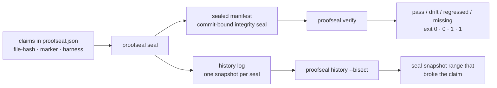

# ProofSeal

**README claims that stay true.**

Your README says "verify p50: 120ms" and "the #142 fix is in." Six months and forty commits later, nothing has re-checked either one. ProofSeal seals your claims once, then `proofseal verify` classifies every claim as **pass / drift / regressed / missing** — in CI, on every commit — and when one breaks, `proofseal history --bisect` tells you the seal-snapshot range where it happened.

```
Before: "verify p50: 120ms" sits in your README for a year. It's wrong. You find out from an angry issue.
After:  CI fails the day it stops being true, and `proofseal history --bisect` points at the range that broke it.
```

## How it works



1. **You declare claims once** — "this file hashes to X", "this fix's marker is still in the code", "this seeded command still prints these numbers".
2. **`seal` records them** into a manifest bound to the current commit, and appends a snapshot to the history log. It prints the files to commit.
3. **`verify` re-checks everything** — locally or in CI — and classifies each claim. Harmless change is `drift` (exit 0); broken promise is `regressed` (exit 1).
4. **`history --bisect` remembers** — every seal is a snapshot, so when a claim regresses, you get the seal-snapshot range where it happened (between snapshots, not down to a single commit — granularity is how often you seal, so seal in CI on main and bisect also prints how many commits the range spans).

## 60-second quickstart

```bash
npm install --save-dev proofseal

npx proofseal init                 # scaffolds proofseal.json + proofs/ + a sample claim

# Add claims one at a time...
npx proofseal claim add --id fix-null-check --type marker \
  --file src/parser.ts --marker "guard: input ?? fallback" \
  --desc "Null-input fix from #142 is still present"

# optional — batch-author many at once (requires a claims.json you author)
npx proofseal claim add --from-file claims.json

npx proofseal seal                 # hash files, seal manifest, append history snapshot
                                   # → prints "Now commit these files: proofseal.json, proofs/…" — commit them all
npx proofseal verify               # exit 0 = pass/drift, 1 = regressed/missing/seal mismatch, 2 = precondition
```

When something regresses later:

```bash
npx proofseal history --bisect
# fix-null-check: last pass 428088b4e1d2 → regressed at a91c03ffe002
#   range spans 14 commits — seal more often (e.g. in CI on main) for tighter localization
```

Bisect localizes between **seal snapshots**, not commits — seal in CI on main (single writer, linear history) for the tightest ranges. If branches seal concurrently, add `proofs/history.jsonl merge=union` to `.gitattributes`: entries are ordered by `issuedAt`, so union-merge interleaving is safe.

## Claim types

| Type | What it asserts | On change |
|------|-----------------|-----------|
| `file-hash` | The file's sha256 matches the sealed hash | Any content change classifies as **regressed** — for a file-hash claim the hash *is* the expectation, so there is no drift state |
| `marker` | A distinctive substring is still present in the file (proves a fix survived refactors) | File edited but marker intact → **drift**; marker gone → **regressed**; file gone → **missing** |
| `harness` | A seeded command's numeric output stays deterministic (round-half-even quantization; falls back to rtol/atol tolerance against a committed reference vector) | Exact-hash match → **pass**; within tolerance → **drift**; outside tolerance → **regressed** |

`drift` exists only for marker and harness claims. Exit-code contract: `0` for pass/drift, `1` for regressed/missing/seal mismatch, `2` for preconditions (e.g. the build-output directory was never built, a harness command isn't installed, or seal outputs weren't committed — each precondition is named in the output).

## Run it in CI

Copy this into `.github/workflows/proofseal.yml`:

```yaml
name: Verify proofseal manifest

on:
  push:
    branches: [main]
  pull_request:
    branches: [main]

jobs:
  verify:
    runs-on: ubuntu-latest
    steps:
      # fetch-depth: 1 is sufficient — verify re-derives the key from the
      # manifest's embedded gitCommit and never shells out to git.
      - uses: actions/checkout@v4
        with:
          fetch-depth: 1

      - uses: actions/setup-node@v4
        with:
          node-version: 22

      # Note: manifest.gitCommit intentionally lags HEAD — it records the
      # commit that was checked out at seal time, not the verifying commit.
      - name: Verify sealed manifest
        run: npx proofseal verify
```

Two things first-time CI users hit:

- **Commit the seal outputs.** `seal` writes the manifest, the rewritten `proofseal.json`, and any harness reference vectors — and prints the exact list. If CI says `reference-vector-not-found`, you sealed locally and didn't commit the outputs.
- **`manifest.gitCommit` ≠ HEAD is normal.** It records the commit at seal time. Verification works against it directly.

## The seal (threat model)

ProofSeal's manifest carries a **commit-bound integrity seal**: the sealing key is derived from `sha256(gitCommit:salt:'proofseal/v1')`, so there is no key to generate, store, or rotate, and the manifest can be verified outside any git context — exported in a tarball, attached to a release — while staying bound to the exact commit it sealed, even on `fetch-depth: 1` clones.

What it is: **tamper-evidence**. A corrupted or hand-edited manifest fails verification.
What it is not: **third-party authentication**. Anyone with the public commit SHA can re-derive the key, so the seal proves *which commit* a manifest belongs to — not *who* sealed it. If you need to prove identity, use cosign on top; the two compose (see benchmarks below).

Zero runtime crypto dependencies — Node's built-in crypto, plus commander, zod, and the MCP SDK.

## MCP server

ProofSeal ships an MCP stdio server so agents can verify and seal claims directly:

```bash
claude mcp add proofseal -- npx proofseal mcp start
```

Seven tools:

- `verify_claims` — run full verification, returns seal status + per-claim classification
- `seal_manifest` — refresh claims, seal, append a history snapshot
- `check_drift` — report drift-only deltas without failing
- `claim_history` — timeline of statuses for one claim
- `find_regression` — bisect history for the seal-snapshot range that introduced a regression (with SHA reachability and commit-count info when git can resolve them)
- `run_harness` — execute one harness claim and report pass/drift/regressed
- `list_claims` — enumerate configured claims

## Library API

```ts
import { seal, verify } from 'proofseal';

const sealed = await seal({ root: '.' });
// sealed.filesWritten → the files to commit

const result = await verify({ root: '.' });
// result.summary → { totalClaims, pass, drift, regressed, missing }
// result.exitCode → 0 | 1 | 2
```

## Benchmarks

ProofSeal, cosign, and in-toto solve different problems and **they stack**: ProofSeal for claim semantics and history, cosign for artifact identity, in-toto for supply-chain steps. The comparison below is about *adoption cost* and *which capabilities exist* — all tools installed and measured on the same machine (three bench fixtures in `bench/fixtures/`, 100 claims each; Apple M4 Pro, Node v22.19.0). Full report with provenance, seeds, and per-mutation breakdown: [`bench/results/report.md`](bench/results/report.md).

| Metric | ProofSeal | checksum script | cosign (keyless) | cosign (keypair) | in-toto |
|---|---|---|---|---|---|
| Setup steps (count) | 4 | 3 | 3 | 3 | 4 |
| Setup time (median, s) | 12.14 | 0.03 | N/A — requires interactive OIDC | 3.07 | 1.47 |
| Config LOC | 7 | 109 | 53 | 53 | 64 |
| Secrets to manage (count) | 0 | 0 | 0 | 1 | 1 |
| Verify latency p50 / p95 (ms) | 117.9 / 270 | 677.3 / 729.4 | N/A — requires interactive OIDC | 714.4 / 1252.7 | 264.5 / 272.2 |
| Tamper signaled (% of 45) | 100% (45/45) | 100% (45/45) | N/A — requires interactive OIDC | 100% (45/45) | 100% (45/45) |
| Four-state classification (ProofSeal taxonomy) | 45/45 (100%) | N/A — taxonomy absent | N/A — taxonomy absent | N/A — taxonomy absent | N/A — taxonomy absent |
| Drift vs regression distinction | yes | N/A — capability absent | N/A — capability absent | N/A — capability absent | N/A — capability absent |
| Temporal history + bisection | yes | N/A — capability absent | N/A — capability absent | N/A — capability absent | N/A — capability absent |

Reading the table: every real tool signals 100% of the 45 seeded mutations, each judged under its own semantics — a cosign hard FAIL on a benign append is correct for cosign's security model, and a practitioner-grade `SHA256SUMS` over all git-tracked files catches every byte-level change. ProofSeal's difference is not a detection score the others failed; it's the rows below the headline: the four-state classification (pass/drift/regressed/missing) and seal history with bisection are capabilities the other tools don't have. The four-state row is ProofSeal's own taxonomy, so competitors are marked N/A rather than scored against it. The cosign-keyless cells marked N/A require an interactive OIDC browser flow that can't run headless; its setup steps, config LOC, and secrets were measured statically.

## FAQ

**Why does `seal` exit 1 but still write history when a claim fails?**

A failing snapshot is what lets `history --bisect` localize the regression later. Skipping the snapshot would destroy the evidence.

**Can I use `verify --json` in CI?**

Yes — the JSON schema is pinned (v1) and the exit-code contract (0/1/2) is stable. Drift does not fail the build; regressions and missing claims do.

**What happens when a teammate clones and verifies?**

It works — verify needs only the committed manifest, `proofseal.json`, and reference vectors. That's why `seal` prints the commit checklist: it lists every file verify needs that isn't committed yet (including `proofseal.json` when it's still untracked), so the outputs travel together.

## Support

ProofSeal is maintained by one person. Realistic expectations:

- **Bugs:** open an issue with the [bug template](https://github.com/rudycelekli/proofseal/issues/new?template=bug.yml) — OS, node version, exact command, and the `verify --json` output. That JSON is usually enough to fix it without back-and-forth.
- **Response time:** issues are triaged daily; expect a first response within ~48h.
- **Windows:** best-effort in v0.1 (see Limitations) — reports are still very welcome and get fixed.

## ⚠️ Limitations

Read this before adopting. ProofSeal v0.1 is built and maintained by a solo maintainer; the surface is small on purpose.

- **Content-hashed build outputs break file-hash claims every build.** A Vite output like `index.Dk3mP9qR.js` gets a new name and hash on every rebuild. Don't put file-hash claims on hashed bundles; claim the source, or use a marker on a stable file.
- **Non-deterministic test suites can't be harness claims.** Harness claims require seeded, deterministic numeric output. Parallel test runners, wall-clock timings, and unordered output will produce permanent drift or regression noise.
- **Cross-platform hash divergence on built artifacts.** `seal` records the platform, and `verify` warns when the sealed platform differs from the verifying one — but binary artifacts may legitimately differ across platforms. Seal and verify built artifacts on the same platform, or claim only platform-independent files.
- **git autocrlf can flip text hashes.** Pin line endings with `.gitattributes` (`* text=auto eol=lf`) before sealing file-hash claims on text files. When a regression is caused purely by line endings, verify says so in the claim detail.
- **Windows is best-effort and untested in v0.1.** The suite is tested on ubuntu and macos; the Windows CI lane runs non-blocking (`continue-on-error`) until it has been observed green, at which point Windows is promoted to a supported tier. Claim paths are normalized to forward slashes on all platforms, but known residuals exist: harness commands are spawned through the platform shell, so POSIX-isms (`python3`, `&&`) may fail under cmd.exe, and cmd.exe reports command-not-found as exit 9009 rather than 127.
- **Bisect granularity is seal frequency, and rewritten history orphans recorded SHAs.** `history --bisect` localizes between seal snapshots, not commits — it prints how many commits the range spans, but the fix is to seal more often (CI on main: single writer, linear history). Squash-merge, rebase, or force-push can leave history pointing at SHAs git no longer knows; bisect tags those `(unreachable — rewritten history?)`. If branches seal concurrently, add `proofs/history.jsonl merge=union` to `.gitattributes` — entries are ordered by `issuedAt`, so interleaving is safe.
- **Markers in minified or generated code are fragile.** Minifiers rename and reflow; put markers in source, not in `dist/`.
- **Benchmark scope.** All numbers above are from three synthetic fixtures (npm lib, Python tool, docs site; 100 claims each). Repos with thousands of claims, huge files, or heavy harness suites have not been measured.

## Prior art & credits

ProofSeal is a fresh implementation, but it stands on ideas from the [ruvnet](https://github.com/ruvnet) open-source ecosystem:

- **ruflo** — the sealed witness-manifest concept (sealing fix claims into a verifiable manifest, with regression bisection over seal history) is the direct inspiration for ProofSeal's seal/verify/bisect loop.
- **RuVector** — its marker-based "is the fix still present in the live tree" verification pattern shaped ProofSeal's marker claim type and drift-vs-regression distinction.
- The broader ruvnet agent ecosystem informed the MCP tool design: fail-open tool results and structured-content-first responses.

Thanks to [rUv](https://github.com/ruvnet) and the Agentics Foundation community for publishing this work openly — ProofSeal generalizes those ideas into a standalone tool any repo can adopt.

## License

MIT © [rudycelekli](https://github.com/rudycelekli)
